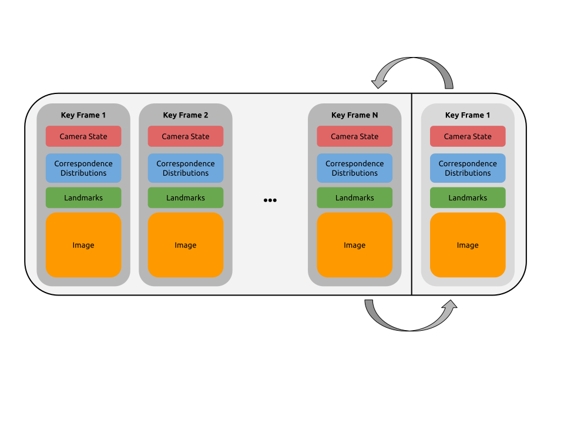

# Graph

The Graph is QDVO's core data structure for representing the SLAM problem. 
The Graph was designed in a way which allows QDVO to preallocate all required memory.

The graph stores a constant number, N, keyframes and one keyframe which is called the current frame. The current frame holds all information required to estimate the pose of the current frame. If, after pose estimation, the current frame is determined to be a keyframe, a keyframe from the keyframe set is chosen to be marginalized. After marginalization, the current frame is swapped into the marginalized keyframe position. After the swap, the current frame is reset. 

Resetting a keyframe does not delete any memory used by the keyframe. Instead, it sets a large group of flags inside each of the core members such as the correspondence distributions and landmark array.
